# 📈 Analyse et Prévision de Séries Temporelles — Constructions Immobilières en Espagne


Ce projet présente une analyse complète d’une série temporelle liée aux **constructions immobilières en Espagne** sur la période **Janvier 1982 — Janvier 2015**.  
L’objectif principal est de comprendre l’évolution historique du marché, détecter les ruptures, stabiliser la série, construire un modèle de prévision fiable et générer une prévision finale sur 24 mois.

<p align="center">
  
</p>

---

## 🎯 Objectifs du projet

- Étudier l’évolution temporelle des constructions immobilières.
- Identifier la **tendance**, la **saisonnalité**, la **volatilité** et les **ruptures structurelles**.
- Stabiliser la série par transformation logarithmique et différenciation.
- Utiliser la méthodologie **Box-Jenkins** pour construire un modèle SARIMAX.
- Optimiser le modèle avec `auto.arima` selon les critères **AIC** et **BIC**.
- Valider le modèle sur une période cachée de 24 mois (**out-of-sample validation**).
- Produire une prévision finale avec intervalles de confiance.
- Comparer l’approche statistique avec des modèles IA / Deep Learning.

---

## 🧰 Technologies utilisées

| Catégorie | Outils / Packages |
|---|---|
| Langage | R |
| Manipulation & lecture | `readxl`, `zoo` |
| Séries temporelles | `forecast`, `tseries`, `strucchange` |
| Visualisation | `ggplot2`, `autoplot` |
| Métriques | `Metrics` |
| Modèles IA optionnels | `keras3`, LSTM, GAN, VAE, Transformer |

---

## 📁 Structure recommandée du dépôt

```text
.
├── README.md
├── time_series_analysis_indus.r
├── value of real estate constructions.xlsx      # optionnel : dataset original
├── assets1/
│   ├── statistique_desc_industrielle.png
│   ├── serie_Original_evolution_dans_le_temps.png
│   ├── decomposition STL.png
│   ├── evolution_volatilite_annuelle_ecarrt_type.png
│   ├── serie_apres_transformation_logarithmique.png
│   ├── serie_with_repture_structurelle_detected.png
│   ├── serie_stationnaire_apres_diff.png
│   ├── acf_pacf.png
│   ├── Auto_Arima.png
│   ├── validattion_out_of_sample.png
│   ├── controle_tech_residus.png
│   ├── forecast.png
│   ├── ia_gen.png
│   └── prevision_final.png
└── rapport_plots_pro/                         # généré automatiquement par le script
```

> Le script R crée automatiquement le dossier `rapport_plots_pro/` et y sauvegarde les graphiques générés.

---

## 📊 1. Présentation statistique des données

La série contient **397 observations mensuelles**, de **Janvier 1982 à Janvier 2015**. Les premières statistiques montrent un marché cyclique, avec une moyenne autour de **112.33**, un minimum de **31.90** et un maximum de **197.90**.

<p align="center">
  
</p>

### Lecture rapide

- La série présente une **forte amplitude** : le maximum est plus de 6 fois supérieur au minimum.
- Le coefficient de variation est élevé, ce qui indique une série sensible et volatile.
- La diminution globale montre un marché fortement affecté par une rupture importante.

---

## 📉 2. Visualisation de la série originale

<p align="center">
  
</p>

### Interprétation

La série n’est pas stable dans le temps. On observe :

- une forte saisonnalité répétée chaque année ;
- une période élevée avant les années 2000 ;
- une chute brutale autour de 2002 ;
- une reprise progressive après la rupture.

Cette forme montre que la série n’est pas directement stationnaire.

---

## 🧩 3. Décomposition STL : tendance, saisonnalité et résidus

La décomposition STL permet de séparer la série en trois composantes principales :

- **Trend** : évolution de long terme ;
- **Seasonal** : comportement saisonnier répété ;
- **Remainder** : bruit / résidus non expliqués.

<p align="center">
  
</p>

### Interprétation

La composante saisonnière est claire et régulière. La tendance montre une baisse brutale après la rupture, suivie d’une reprise progressive. Cette étape confirme que la série contient à la fois une tendance et une saisonnalité.

---

## 📌 4. Analyse de la volatilité et transformation logarithmique

Avant de construire un modèle, il faut vérifier si la variance est stable. Si la volatilité augmente ou varie fortement, une transformation logarithmique peut être nécessaire.

<p align="center">
  
</p>

La transformation logarithmique permet de réduire l’effet des grandes variations et de rendre la série plus stable.

<p align="center">
  
</p>

### Interprétation

Après transformation logarithmique, la variance devient plus contrôlée. Cette étape améliore la qualité de la modélisation SARIMAX.

---

## ⚠️ 5. Détection d’une rupture structurelle

Une rupture structurelle correspond à un changement brutal du comportement de la série. Ici, une rupture importante est détectée autour de **2002**.

<p align="center">
  
</p>

### Interprétation

La rupture représente un changement profond du marché. Pour éviter de fausser le modèle, une variable d’intervention appelée **dummy variable** est ajoutée :

- `0` avant la rupture ;
- `1` après la rupture.

Cette variable permet au modèle de tenir compte du choc structurel.

---

## 🔄 6. Stationnarisation de la série

La méthodologie Box-Jenkins exige une série stationnaire pour analyser correctement l’ACF et la PACF. Le script applique les différenciations nécessaires.

<p align="center">
  
</p>

### Interprétation

Après différenciation, la série fluctue autour de zéro. Cela signifie que la tendance principale a été réduite et que la série devient plus adaptée à la modélisation ARIMA / SARIMA.

---

## 📐 7. Analyse ACF / PACF

Les graphiques ACF et PACF permettent d’identifier les paramètres possibles du modèle :

- **ACF** aide à détecter la partie MA(q) ;
- **PACF** aide à détecter la partie AR(p) ;
- les pics aux multiples de 12 indiquent une possible saisonnalité annuelle.

<p align="center">
  
</p>

### Lecture rapide

Les corrélogrammes montrent encore quelques pics significatifs. Cela justifie le test de plusieurs modèles SARIMAX et l’utilisation d’une optimisation automatique par AIC / BIC.

---

## 🤖 8. Optimisation avec Auto.ARIMA

Plusieurs modèles SARIMAX sont testés, puis triés selon le critère **AIC**. Le meilleur modèle est celui qui minimise l’AIC tout en gardant une complexité raisonnable.

<p align="center">
  
</p>

### Modèle retenu

Le meilleur modèle affiché dans le benchmark est :

```text
AUTO: Regression with ARIMA(3,0,0)(0,1,1)[12] errors
```

Ce modèle intègre :

- une composante ARIMA ;
- une composante saisonnière annuelle ;
- une variable externe de rupture structurelle.

---

## ✅ 9. Validation out-of-sample

Le modèle est testé sur les **24 derniers mois cachés**. Cette validation permet de vérifier si le modèle prédit correctement des données qu’il n’a pas vues pendant l’entraînement.

<p align="center">
  
</p>

### Résultats

| Métrique | Valeur | Interprétation |
|---|---:|---|
| RMSE | 7.39 | Erreur moyenne en valeur brute |
| MAPE | 5.76% | Erreur relative faible |

Le modèle est donc considéré comme **acceptable**, car le MAPE est inférieur à 15%.

---

## 🧪 10. Contrôle technique des résidus

Après validation, les résidus sont analysés pour vérifier la qualité du modèle.

<p align="center">
  
</p>

### Tests utilisés

| Test | Objectif | Résultat | Interprétation |
|---|---|---:|---|
| Ljung-Box | Vérifier l’indépendance des résidus | p-value = 0.6892 | Résidus globalement indépendants |
| Shapiro-Wilk | Vérifier la normalité des résidus | p-value = 0.0367 | Normalité imparfaite |

La p-value du test Ljung-Box est supérieure à 0.05, donc les résidus peuvent être considérés comme proches d’un bruit blanc. Le modèle est techniquement acceptable.

---

## 🔮 11. Prévision future

Le modèle final est entraîné sur toute la série disponible, puis utilisé pour produire une prévision sur les 24 mois suivants.

<p align="center">
  
</p>

<p align="center">
  
</p>

### Interprétation

La prévision conserve la saisonnalité observée dans l’historique et fournit des intervalles de confiance. Plus l’horizon augmente, plus l’incertitude devient importante, ce qui est normal en prévision temporelle.

---

## 🧠 12. Comparaison avec des approches IA / Deep Learning

Une extension IA est ajoutée pour comparer les prévisions statistiques classiques avec des modèles plus avancés :

- SARIMAX ;
- ETS ;
- NNAR ;
- TBATS ;
- modèles génératifs / Transformer.

<p align="center">
  
</p>

### Interprétation

Les modèles IA peuvent aider à capturer des relations non linéaires, mais SARIMAX reste un très bon choix lorsque la série est saisonnière, interprétable et de taille moyenne. Dans ce projet, SARIMAX donne une performance solide et facilement explicable.

---

## 🛠️ Installation et exécution

### 1. Cloner le projet

```bash
git clone https://github.com/USERNAME/REPOSITORY_NAME.git
cd REPOSITORY_NAME
```

### 2. Installer les packages R nécessaires

```r
install.packages(c(
  "readxl", "tseries", "forecast", "ggplot2",
  "strucchange", "zoo", "Metrics", "tidyr", "scales"
))
```

Pour la partie IA / Deep Learning :

```r
install.packages("keras3")
```

> La partie IA peut nécessiter une configuration Python / TensorFlow selon votre environnement.

### 3. Ajouter le dataset

Placer le fichier Excel dans la racine du projet avec le nom suivant :

```text
value of real estate constructions.xlsx
```

Si le fichier n’est pas présent, le script génère automatiquement une série simulée pour permettre le test du pipeline.

### 4. Lancer l’analyse

```bash
Rscript time_series_analysis_indus.r
```

Les graphiques seront générés automatiquement dans :

```text
rapport_plots_pro/
```

---

## 🧾 Résumé de la méthodologie

```mermaid
flowchart LR
    A[Données mensuelles] --> B[Analyse descriptive]
    B --> C[Décomposition STL]
    C --> D[Volatilité + Log]
    D --> E[Détection rupture]
    E --> F[Stationnarisation]
    F --> G[ACF / PACF]
    G --> H[Auto.ARIMA / SARIMAX]
    H --> I[Validation Out-of-Sample]
    I --> J[Diagnostic des résidus]
    J --> K[Prévision finale 24 mois]
```



---

## 📌 Résultats clés

- La série présente une saisonnalité annuelle claire.
- Une rupture structurelle importante est détectée autour de 2002.
- La transformation logarithmique aide à stabiliser la variance.
- La validation out-of-sample donne un **MAPE de 5.76%**, ce qui indique une bonne qualité prédictive.
- Le test de Ljung-Box montre que les résidus sont globalement indépendants.
- SARIMAX est retenu comme modèle principal pour sa performance et son interprétabilité.

---

## ✅ Conclusion

Ce projet montre une démarche complète de prévision de séries temporelles : de l’exploration statistique jusqu’à la prévision finale.  
Le modèle SARIMAX permet d’obtenir une prévision fiable, tout en restant interprétable. La comparaison avec des modèles IA ouvre aussi la voie à des extensions futures pour améliorer la performance ou générer plusieurs scénarios.

---

## 👤 Auteur

Projet réalisé dans le cadre d’un travail académique en analyse de séries temporelles.

