# 📈 Projet Final — Analyse et Prévision de Séries Temporelles

# Time Series Forecasting Lab

## Real Estate & Food Production Analysis


Ce dépôt regroupe **deux projets complets de séries temporelles** réalisés avec **R**.  
Chaque partie traite un **dataset différent**, avec sa **propre méthodologie**, ses **propres visuels** et sa **propre conclusion**.

Les deux études suivent une logique Box-Jenkins :

- exploration et diagnostic statistique ;
- analyse de la tendance, de la saisonnalité et de la volatilité ;
- transformation si nécessaire ;
- stationnarisation ;
- identification du modèle ;
- modélisation SARIMA / SARIMAX ;
- validation sur données cachées ;
- prévision finale.

---

## 📚 Contenu du projet

### 1) `value-of-real-estate-constructions`
Analyse d’une série temporelle sur les **constructions immobilières** avec prise en compte d’une **rupture structurelle majeure**, d’une **transformation logarithmique**, d’une **validation out-of-sample**, et d’une **prévision finale sur 24 mois**.

### 2) `Industrial-Production-food-S-C11`
Analyse d’une série temporelle de **production alimentaire** avec **correction des additive outliers**, **décomposition STL**, **focus sur les données récentes**, **modélisation SARIMA**, puis **prévisions futures**.

---

## 🗂️ Structure du dépôt

```text
.
├── README.md
├── time_series_analysis_indus.r
├── time_series_analysis_alim.r
├── assets1/   # images du dataset value-of-real-estate-constructions
└── assets2/   # images du dataset Industrial-Production-food-S-C11
```

---

# PARTIE I — `README_time_series`
# 🏗️ Analyse et Prévision de Séries Temporelles — Value of Real Estate Constructions

## 🎯 Objectif du premier dataset

Ce premier travail porte sur un dataset représentant l’évolution des **constructions immobilières**.  
L’objectif est de :

- comprendre l’évolution historique de la série ;
- identifier la tendance, la saisonnalité et la volatilité ;
- détecter une éventuelle rupture structurelle ;
- stabiliser la série pour la modélisation ;
- sélectionner un modèle de prévision robuste ;
- valider le modèle sur une période cachée ;
- produire une prévision finale exploitable.

Ce projet est plus qu’un simple ajustement statistique : il montre une **démarche complète d’analyse de séries temporelles**, depuis l’exploration jusqu’à la prévision, avec en bonus une **comparaison avec des approches IA / Deep Learning**.

---

## 🧾 Aperçu global du premier dataset

- **Série étudiée** : constructions immobilières
- **Fréquence** : mensuelle
- **Période** : **Janvier 1982 — Janvier 2015**
- **Nombre d’observations** : **397**
- **Approche principale** : **SARIMAX**
- **Particularité du dataset** : présence d’une **rupture structurelle** importante

---

## 📊 1. Statistiques descriptives

Cette première étape permet de situer la série avant toute modélisation.

<p align="center">
  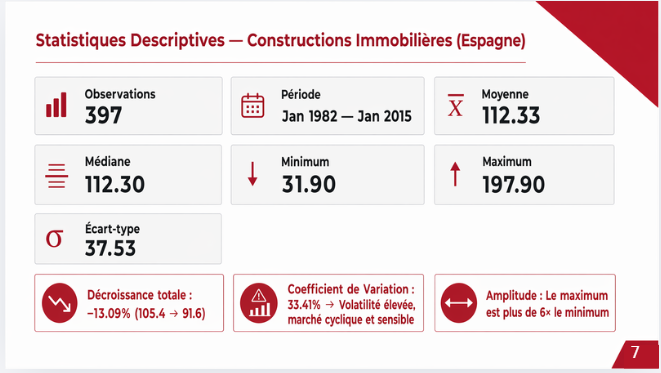
</p>

### Ce qu’on observe

- **Moyenne** : 112.33  
- **Médiane** : 112.30  
- **Minimum** : 31.90  
- **Maximum** : 197.90  
- **Écart-type** : 37.53  
- **Coefficient de variation** : 33.41%

### Interprétation

Ces statistiques montrent une série :

- assez **volatile** ;
- marquée par une **forte amplitude** ;
- sensible aux changements de régime ;
- affectée globalement par une **décroissance totale de -13.09%** sur la période étudiée.

---

## 📉 2. Visualisation de la série originale

<p align="center">
  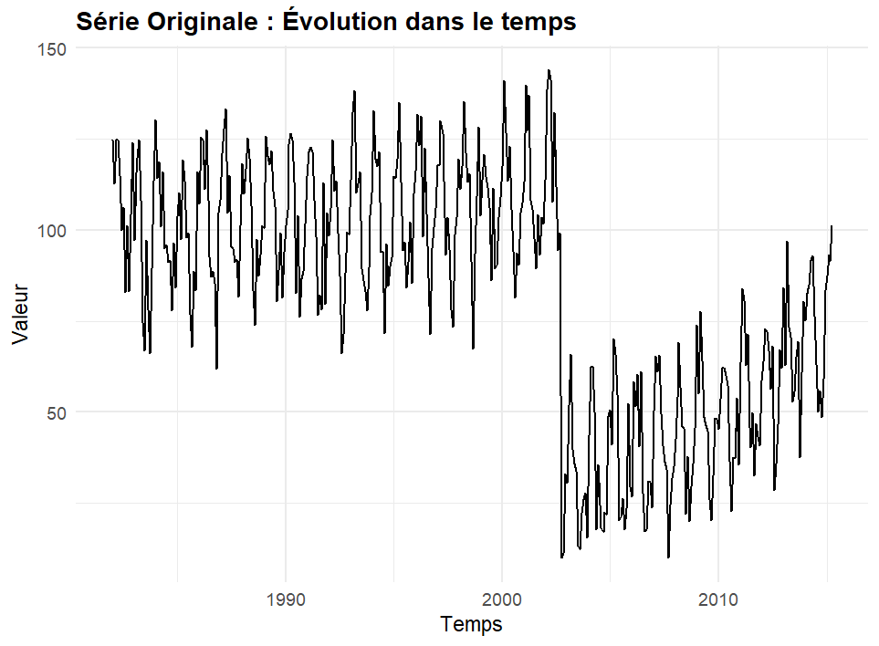
</p>

### Interprétation

La série originale montre immédiatement plusieurs caractéristiques :

- une **saisonnalité visible** ;
- une **évolution non stationnaire** ;
- une phase relativement élevée avant les années 2000 ;
- une **forte cassure** suivie d’un changement de niveau ;
- une reprise progressive après la chute.

Autrement dit, la série ne peut pas être modélisée directement sans préparation.

---

## 🧩 3. Décomposition STL

La décomposition STL permet de séparer la série en :

- **tendance** ;
- **saisonnalité** ;
- **résidus**.

<p align="center">
  
</p>

### Interprétation

Cette décomposition confirme que :

- la **saisonnalité annuelle** est claire et répétitive ;
- la **tendance** change brutalement à cause d’un choc ;
- les **résidus** contiennent le bruit non expliqué.

Cette étape justifie la suite du traitement statistique.

---

## 📌 4. Analyse de la volatilité

Avant de modéliser, on vérifie si la variance est stable.

<p align="center">
  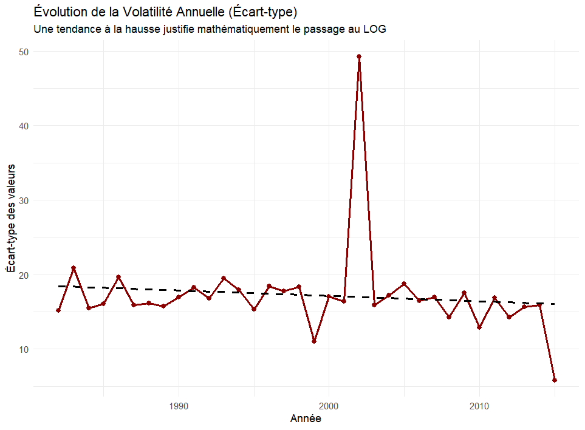
</p>

### Interprétation

L’évolution de l’écart-type annuel montre que la volatilité n’est pas parfaitement stable. Certaines périodes présentent des écarts beaucoup plus élevés, ce qui motive une transformation de la série.

---

## 🔄 5. Transformation logarithmique

La transformation logarithmique est utilisée pour réduire l’effet des fortes variations et rendre la série plus homogène.

<p align="center">
  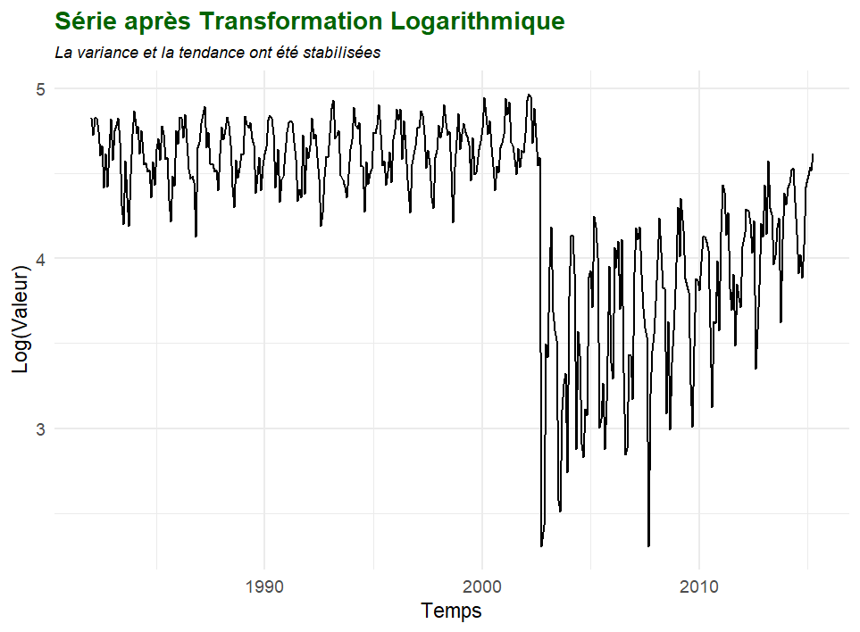
</p>

### Interprétation

Après transformation log :

- la variance devient plus stable ;
- l’échelle est plus adaptée à la modélisation ;
- les grandes oscillations sont mieux contrôlées.

---

## ⚠️ 6. Détection de rupture structurelle

Une des étapes les plus importantes de ce premier dataset est la **détection de rupture structurelle**.

<p align="center">
  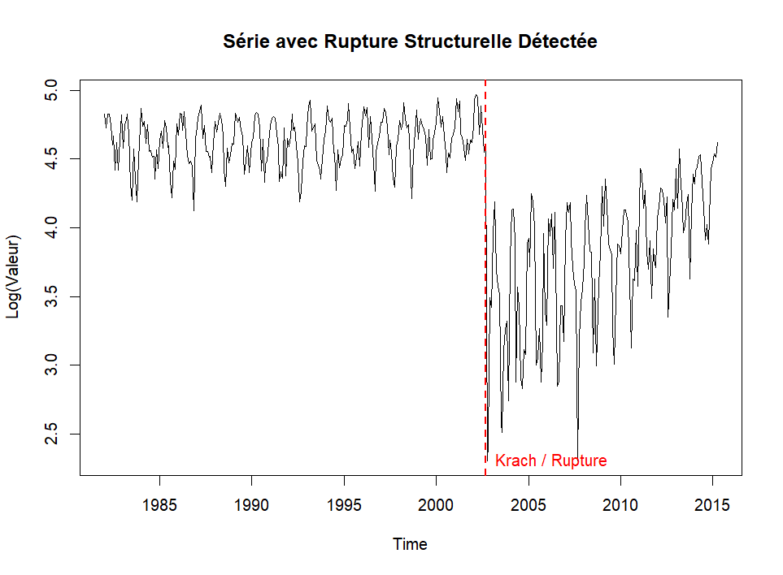
</p>

### Interprétation

Une rupture majeure est détectée autour de **2002**. Cela signifie que la dynamique du marché a changé brutalement.

Pour tenir compte de ce changement, le script construit une **variable dummy** :

- `0` avant la rupture ;
- `1` après la rupture.

Cette variable joue le rôle d’**intervention structurelle** dans le modèle SARIMAX.

---

## 🧪 7. Stationnarisation

La série doit être rendue stationnaire avant l’identification ACF/PACF.

<p align="center">
  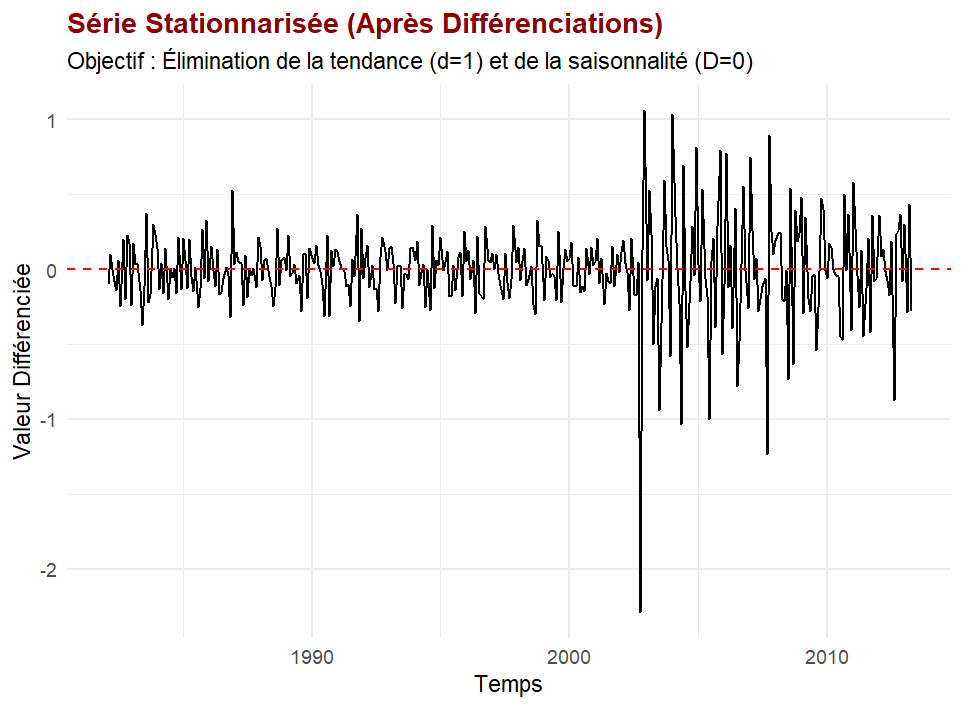
</p>

### Interprétation

Après différenciation, la série fluctue autour de zéro. Cela indique que :

- la tendance a été retirée ;
- la composante non stationnaire a été réduite ;
- la série devient adaptée à la modélisation Box-Jenkins.

---

## 📐 8. Identification visuelle avec ACF / PACF

<p align="center">
  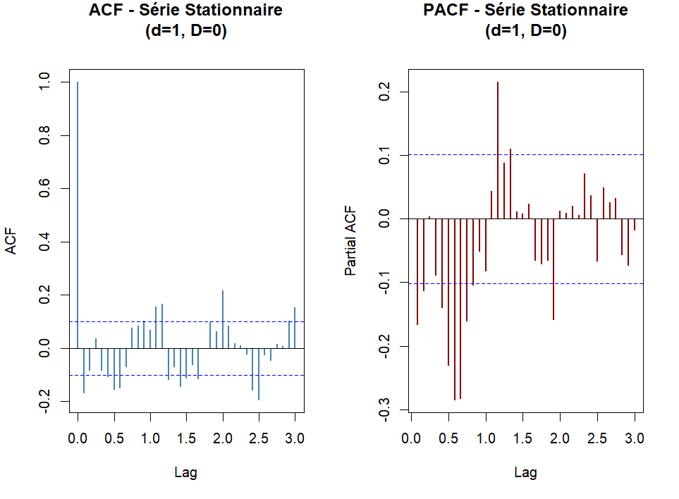
</p>

### Rôle de ces graphes

- **ACF** : aide à choisir les composantes **MA(q)** et **saisonnières Q** ;
- **PACF** : aide à choisir les composantes **AR(p)** et **saisonnières P**.

### Interprétation

Les pics observés justifient le test de plusieurs modèles SARIMAX avant de retenir le meilleur selon AIC/BIC.

---

## 🤖 9. Optimisation du modèle avec Auto.ARIMA

<p align="center">
  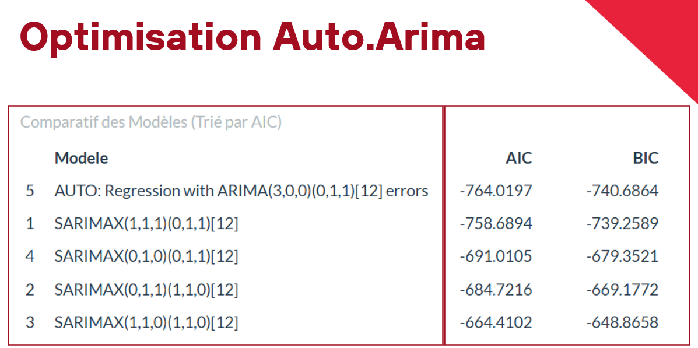
</p>

### Modèle retenu

Le meilleur modèle affiché par l’optimisation est :

```text
Regression with ARIMA(3,0,0)(0,1,1)[12] errors
```

### Pourquoi ce modèle ?

Parce qu’il propose un bon compromis entre :

- qualité d’ajustement ;
- gestion de la saisonnalité ;
- intégration de la rupture structurelle ;
- simplicité relative selon les critères AIC/BIC.

---

## ✅ 10. Validation out-of-sample

Le modèle est évalué sur les **24 derniers mois cachés**.

<p align="center">
  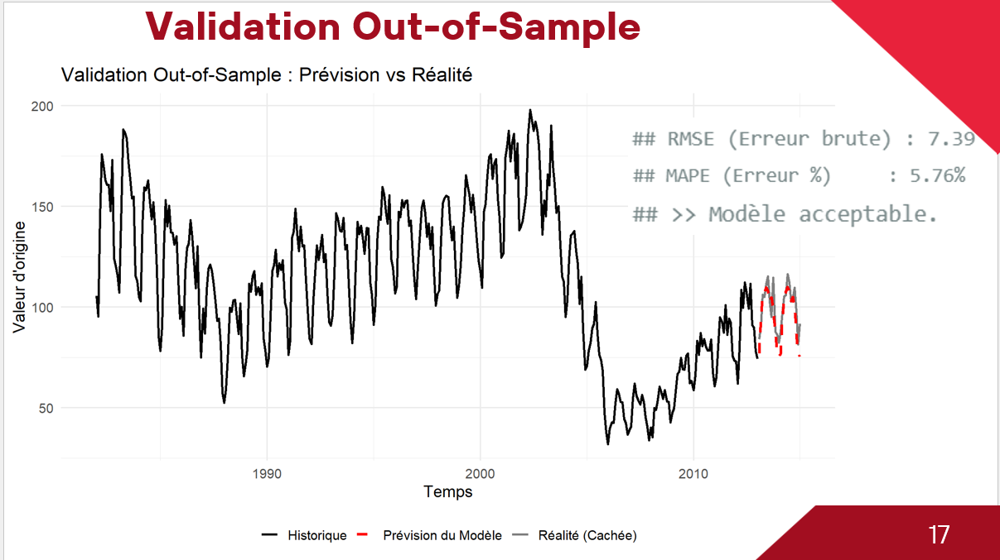
</p>

### Résultats

| Métrique | Valeur |
|---|---:|
| RMSE | 7.39 |
| MAPE | 5.76% |

### Interprétation

- le **MAPE = 5.76%** indique une bonne qualité prédictive ;
- le modèle est **acceptable à bon** ;
- la prévision reste proche de la réalité cachée.

---

## 🧰 11. Contrôle technique des résidus

Un bon modèle ne doit pas laisser de structure importante dans ses résidus.

<p align="center">
  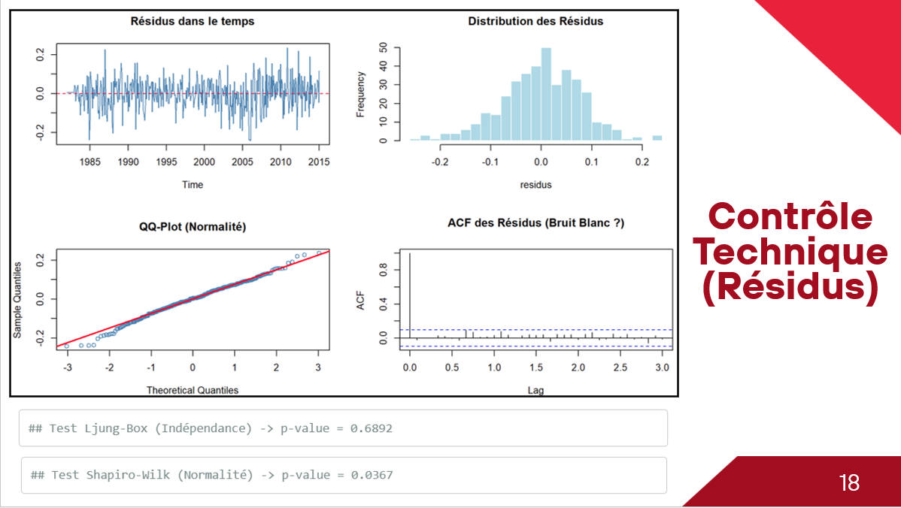
</p>

### Tests effectués

| Test | But | Résultat |
|---|---|---:|
| Ljung-Box | vérifier l’indépendance | p-value = 0.6892 |
| Shapiro-Wilk | vérifier la normalité | p-value = 0.0367 |

### Interprétation

- le test de **Ljung-Box** est satisfaisant ;
- les résidus peuvent être considérés comme globalement proches d’un **bruit blanc** ;
- la normalité n’est pas parfaite, mais le modèle reste techniquement exploitable.

---

## 🔮 12. Prévision future

Le modèle final est réentraîné sur l’ensemble de la série, puis utilisé pour prévoir les **24 mois suivants**.

<p align="center">
  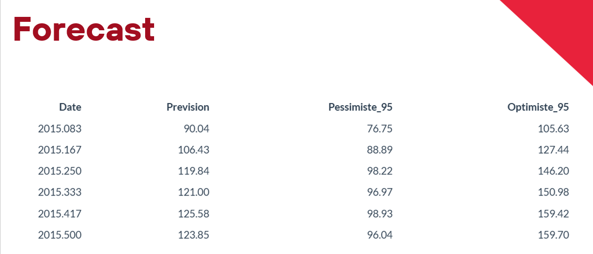
</p>

<p align="center">
  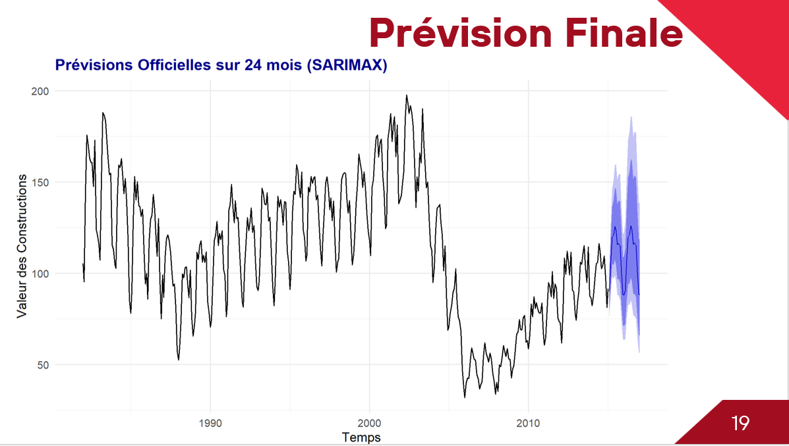
</p>

### Interprétation

La prévision finale :

- conserve la saisonnalité ;
- intègre l’incertitude via des intervalles de confiance ;
- montre une poursuite de la dynamique récente ;
- devient naturellement plus incertaine à mesure que l’horizon augmente.

---

## 🧠 13. Extension IA / Deep Learning

Le script contient aussi une extension comparative avec des approches plus avancées.

<p align="center">
  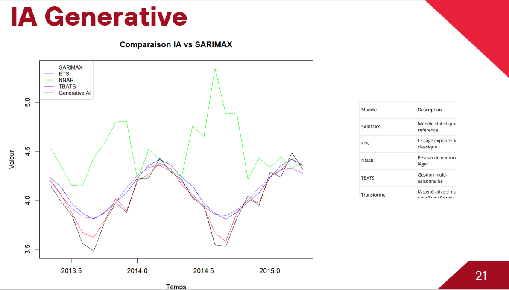
</p>

### Modèles évoqués

- SARIMAX ;
- ETS ;
- NNAR ;
- TBATS ;
- modèles génératifs / Transformer.

### Idée générale

Cette partie permet de comparer les approches classiques et avancées. Malgré cela, **SARIMAX** reste ici un très bon choix grâce à sa :

- robustesse ;
- interprétabilité ;
- bonne qualité prédictive.

---

## 🏁 Bilan du premier dataset

### Résultats clés

- saisonnalité annuelle marquée ;
- rupture structurelle importante ;
- transformation log nécessaire ;
- validation réussie avec **MAPE = 5.76%** ;
- modèle principal : **SARIMAX**.

### Conclusion

Ce premier projet montre une démarche complète de prévision sur une série complexe, avec choc structurel. Le modèle final est fiable, interprétable et pertinent pour une prévision à moyen terme.

---

# PARTIE II — `README_time_series_alimentaire`
# 🍽️ Analyse et Prévision de Série Temporelle — Industrial Production Food (S C11)

## 🎯 Objectif du deuxième dataset

Ce second travail concerne le dataset **Industrial-Production-food-S-C11**.  
Le but est de modéliser l’évolution de la **production alimentaire**, d’identifier ses principales composantes, de corriger les anomalies éventuelles, puis de construire un modèle de prévision performant sur la période récente.

Les objectifs sont les suivants :

- analyser la dynamique générale de la série ;
- mesurer la stabilité de la variance ;
- appliquer une transformation logarithmique ;
- détecter et corriger les **Additive Outliers** ;
- étudier la tendance et la saisonnalité via STL ;
- tester la stationnarité ;
- identifier les paramètres SARIMA ;
- valider le modèle sur 24 mois ;
- produire des prévisions futures.

---

## 🧾 Aperçu global du deuxième dataset

- **Série étudiée** : production alimentaire — S C11
- **Fréquence** : mensuelle
- **Période** : **Janvier 1972 — Mars 2024**
- **Nombre d’observations** : **627**
- **Approche principale** : **SARIMA**
- **Particularité du dataset** : **focus final sur la période récente depuis 2010**

---

## 📊 1. Statistiques descriptives

<p align="center">
  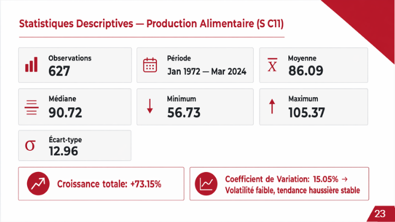
</p>

### Valeurs principales

| Indicateur | Valeur |
|---|---:|
| Observations | 627 |
| Période | Jan 1972 — Mar 2024 |
| Moyenne | 86.09 |
| Médiane | 90.72 |
| Minimum | 56.73 |
| Maximum | 105.37 |
| Écart-type | 12.96 |
| Croissance totale | +73.15% |
| Coefficient de variation | 15.05% |

### Interprétation

La série de production alimentaire présente une **croissance globale positive**, une **volatilité relativement faible**, une **tendance haussière stable** et une saisonnalité mensuelle assez régulière.

---

## 📈 2. Diagnostic statistique

<p align="center">
  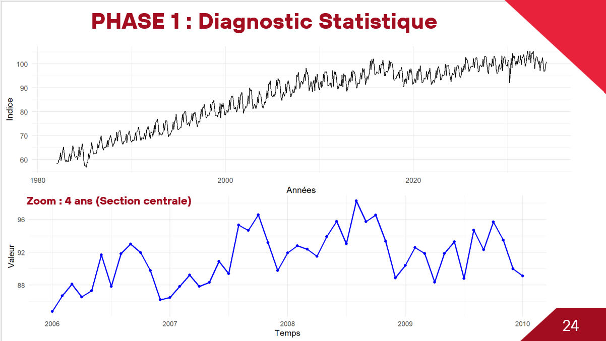
</p>

### Interprétation

La visualisation globale et le zoom montrent une tendance croissante de long terme, des oscillations répétitives, une saisonnalité visible et quelques perturbations ponctuelles. Cette étape permet de comprendre le comportement brut de la série avant transformation.

---

## 📌 3. Test de stabilité de la variance

<p align="center">
  
</p>

### Interprétation

La volatilité glissante varie au cours du temps. Même si elle reste globalement maîtrisée, certains pics justifient le passage à une transformation logarithmique afin de stabiliser la variance.

---

## 🔄 4. Transformation logarithmique

<p align="center">
  
</p>

### Interprétation

Le passage au log permet de stabiliser la variance, de réduire l’effet des fortes fluctuations et d’obtenir une série plus adaptée à l’analyse temporelle.

---

## 🚨 5. Détection et correction des Additive Outliers

<p align="center">
  
</p>

### Interprétation

La méthode **AO (Additive Outliers)** est utilisée pour repérer les chocs ponctuels isolés. Ces points extrêmes peuvent perturber les estimations du modèle. Le nettoyage produit une série plus propre et plus robuste pour la modélisation.

---

## 🧩 6. Décomposition STL

<p align="center">
  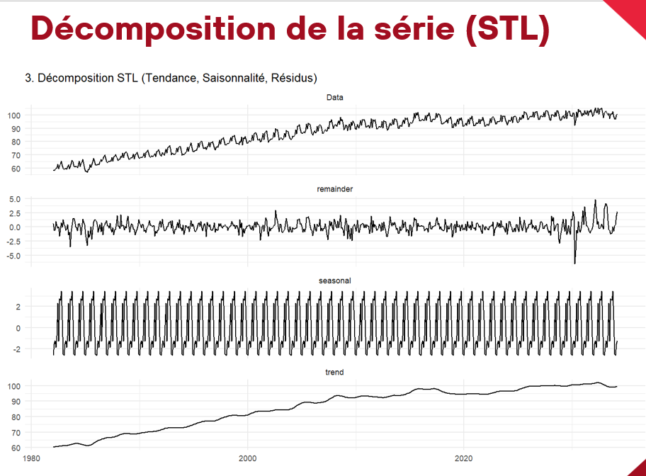
</p>

### Interprétation

La décomposition STL montre une **tendance croissante** sur le long terme, une **saisonnalité régulière** et des résidus relativement maîtrisés. Cette étape confirme la structure saisonnière du dataset.

---

## ⚠️ 7. Détection de ruptures structurelles

<p align="center">
  
</p>

### Interprétation

Le graphique met en évidence plusieurs ruptures potentielles : une rupture vers la fin des années 1990, une autre autour de 2007 et un impact spécifique lié à **COVID** autour de 2020. Pour améliorer la pertinence des prévisions, le script choisit ensuite de se concentrer sur la partie récente de la série.

---

## 🧪 8. Stationnarité et identification

<p align="center">
  
</p>

### Résultat du test ADF

```text
p-value = 0.5322
```

Comme cette valeur est supérieure à 0.05, la série est initialement **non stationnaire**.

Le script conclut à :

- **d = 1** : différenciation simple ;
- **D = 1** : différenciation saisonnière.

---

## 🔁 9. Série après différenciation

<p align="center">
  
</p>

### Interprétation

Après différenciation, la série oscille autour de zéro. La tendance et la saisonnalité sont retirées, ce qui rend la série exploitable pour l’étape d’identification ACF/PACF.

---

## 📐 10. Identification visuelle ACF / PACF

<p align="center">
  
</p>

### Rôle

- **ACF** : identifier les composantes MA, donc `q` et `Q` ;
- **PACF** : identifier les composantes AR, donc `p` et `P`.

Cette lecture guide le choix du modèle SARIMA retenu ensuite par `auto.arima`.

---

## ✂️ 11. Division Train / Test

<p align="center">
  
</p>

### Principe

Le script effectue une séparation sur la période récente :

- **train** : de 2010 jusqu’avant les 24 derniers mois ;
- **test** : les 24 derniers mois.

### Pourquoi ce choix ?

Les comportements récents sont les plus utiles pour prévoir le futur proche. Cela évite qu’un régime ancien ne dégrade la pertinence du modèle.

---

## 🤖 12. Modélisation SARIMA

<p align="center">
  
</p>

### Modèle retenu

```text
ARIMA(1,0,1)(0,1,1)[12] with drift
```

### Critères affichés

- **AIC = -1597.77**
- **AICc = -1597.53**
- **BIC = -1580.07**

### Interprétation

Ce modèle capte correctement la composante autorégressive, la composante moyenne mobile, la saisonnalité annuelle mensuelle sur 12 mois et une légère dérive grâce au paramètre `drift`.

---

## ✅ 13. Validation sur le test set

<p align="center">
  
</p>

### Résultat principal

```text
MAPE = 2.61 %
```

### Interprétation

Un **MAPE de 2.61%** indique une **très bonne performance**. Le modèle prédit avec une erreur moyenne très faible sur les données cachées.

---

## 🌍 14. Validation globale

<p align="center">
  
</p>

### Interprétation

Le graphique global compare l’historique d’apprentissage, la réalité du test set et la prévision du modèle. La prévision suit correctement la réalité cachée, ce qui confirme la bonne capacité prédictive du modèle.

---

## 🔮 15. Tableau des prévisions futures

<p align="center">
  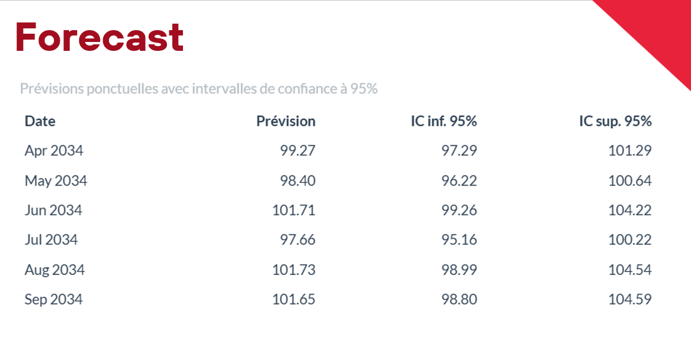
</p>

### Premières prévisions avec intervalle de confiance à 95%

| Date | Prévision | IC inf. 95% | IC sup. 95% |
|---|---:|---:|---:|
| Apr 2034 | 99.27 | 97.29 | 101.29 |
| May 2034 | 98.40 | 96.22 | 100.64 |
| Jun 2034 | 101.71 | 99.26 | 104.22 |
| Jul 2034 | 97.66 | 95.16 | 100.22 |
| Aug 2034 | 101.73 | 98.99 | 104.54 |
| Sep 2034 | 101.65 | 98.80 | 104.59 |

---

## 🏁 16. Prévision finale

<p align="center">
  
</p>
### Interprétation

La prévision finale montre :

- la conservation de la saisonnalité ;
- une dynamique récente cohérente ;
- des intervalles de confiance raisonnables ;
- une bonne fiabilité à court et moyen terme.

---

## 🏆 Bilan du deuxième dataset

### Résultats clés

| Élément | Résultat |
|---|---|
| Série étudiée | Production Alimentaire — S C11 |
| Transformation | Logarithmique |
| Correction | Additive Outliers |
| Différenciation | d = 1, D = 1 |
| Modèle | ARIMA(1,0,1)(0,1,1)[12] with drift |
| Validation | 24 mois |
| Performance | **MAPE = 2.61%** |
| Prévision finale | 24 mois |

### Conclusion

Ce deuxième projet montre une démarche rigoureuse et très réussie. Après nettoyage, transformation et stationnarisation, le modèle SARIMA obtenu offre une **excellente performance prédictive**.

---

# 🛠️ Technologies utilisées

Les deux projets utilisent principalement :

- **R**
- `readxl`
- `forecast`
- `ggplot2`
- `tseries`
- `zoo`

### Packages additionnels selon le dataset

**Projet 1 — constructions immobilières**
- `strucchange`
- `Metrics`
- `keras3` (partie IA)
- `tidyr`
- `scales`

**Projet 2 — production alimentaire**
- `ggfortify`
- `tsoutliers`
- `gridExtra`
- `lubridate`

---

# ▶️ Exécution

## 1. Installer les packages

```r
install.packages(c(
  "readxl", "forecast", "ggplot2", "tseries", "zoo",
  "strucchange", "Metrics", "keras3", "tidyr", "scales",
  "ggfortify", "tsoutliers", "gridExtra", "lubridate"
))
```

## 2. Ajouter les fichiers Excel

### Pour le premier dataset

```text
value of real estate constructions.xlsx
```

### Pour le deuxième dataset

```text
Industrial Production food  S C11.xlsx
```

## 3. Lancer les scripts

```r
source("time_series_analysis_indus.r")
source("time_series_analysis_alim.r")
```

---

# 📌 Résumé final

Ce README final regroupe **deux études complètes de séries temporelles** :

1. **Value of Real Estate Constructions**  
   → série avec rupture structurelle, modélisée par **SARIMAX**, validée avec un **MAPE de 5.76%**.

2. **Industrial Production Food S C11**  
   → série de production alimentaire, nettoyée et modélisée par **SARIMA**, validée avec un **MAPE de 2.61%**.

Ces deux cas montrent une bonne maîtrise de :

- l’exploration statistique ;
- la transformation et la stationnarisation ;
- la sélection de modèles ARIMA/SARIMA/SARIMAX ;
- la validation sur test set ;
- l’interprétation des résultats ;
- la production de prévisions finales.

---

# 👤 Auteur

--Wael Ben Salem

Projet réalisé dans le cadre d’un travail académique en **analyse de séries temporelles avec R**.
